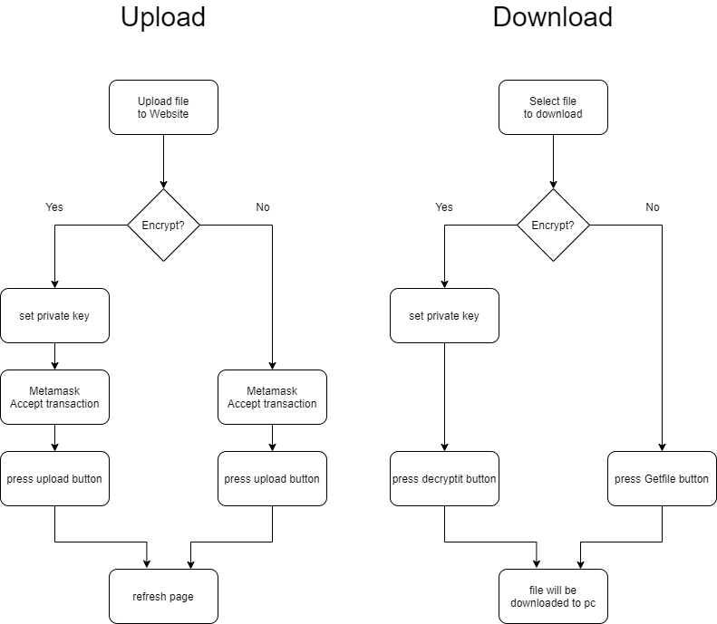

# Task: A DApp on Web


## contract address 
0x4CF247a90956185559EE5fb2A9A7E8dDd8A8E985

## public url 
https://suvincent.github.io/simpleIPFSDrive/

## introduction
Because IPFS is a free network storage space, as long as you know the hash value on the Internet, you can access the data at the nodes of the IPFS service. Therefore, I want to have a website that can record the IPFS hash, and with encryption function, so that individuals can upload and Have basic privacy

## Design for contract and web app
### functions
* upload file
* upload file encrypted
* download file
* decrypt and download file

### user flow

### button operation process
* Upload file encrypt
1.	check if there is private key filled in.
2.	private key turn public key.
3.	generate 256 bits key.
4.	encrypt file by key and use AES CTR mode.
5.	encrypt key by public key.
6.	send file to IPFS.
7.	send file metadata and encrypted key to Ethereum.

* decrypt download file
1.	check if there is private key filled in.
2.	get file metadata and encrypted key from Ethereum.
3.	Decrypt encrypted key by private key.
4.	Get file from IPFS.
5.	Decrypted encrypted file and use AES CTR mode.
6.	Download the decrypted result.

## Test for contract and web app
* contract 
```
truffle develop
truffle migrate 
truffle test
```
* website
Test upload and download file type : txt, pdf, png is currently OK

## DEV steps
### install
```
git clone https://github.com/suvincent/simpleIPFSDrive.git
npm init
npm install
```
### run web
```
cd client
npm start
```
### contract deploy
* in ganache
```
truffle develop
truffle migrate
```
* in ropsten
```
truffle develop
truffle migrate --network ropsten
```

# web deploy
```
cd client
npm run deploy
```

### If web want to change httpprovider

#### use on ganachecli
* in getWeb3.js
```
const provider = new Web3.providers.HttpProvider(
    "http://127.0.0.1:8545"// for development
);
```


#### use on Ropsten
* in getWeb3.js
```
const provider = new Web3.providers.HttpProvider(
    "https://ropsten.infura.io/v3/9f86490b4b644532bfb6e4f26a7ab590"//for testnet
);
```
